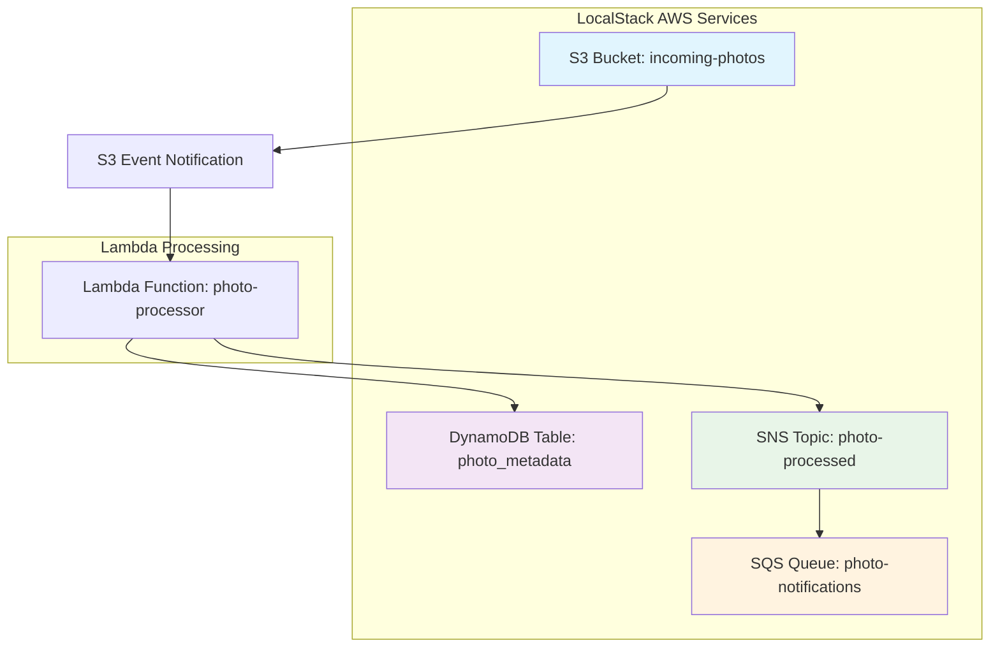

# Photo Processing Application Diagrams

This directory contains architectural diagrams for the photo processing application.

## High-Level Architecture

Shows the main AWS services and their connections in the event-driven pipeline.