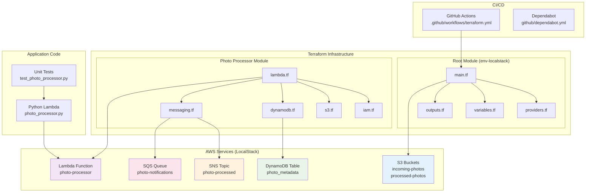

# Complete Architecture with Terraform Structure

```mermaid
graph TB
    subgraph "Terraform Infrastructure"
        subgraph "Root Module (env-localstack)"
            M[main.tf] --> P[providers.tf]
            M --> V[variables.tf]
            M --> O[outputs.tf]
        end

        subgraph "Photo Processor Module"
            LM[lambda.tf] --> IM[iam.tf]
            LM --> SM[s3.tf]
            LM --> DM[dynamodb.tf]
            LM --> MM[messaging.tf]
        end
    end

    subgraph "AWS Services (LocalStack)"
        S3[S3 Buckets<br/>incoming-photos<br/>processed-photos]
        Lambda[Lambda Function<br/>photo-processor]
        Dynamo[DynamoDB Table<br/>photo_metadata]
        SNSTopic[SNS Topic<br/>photo-processed]
        SQSQueue[SQS Queue<br/>photo-notifications]
    end

    subgraph "Application Code"
        Py[Python Lambda<br/>photo_processor.py]
        Test[Unit Tests<br/>test_photo_processor.py]
    end

    subgraph "CI/CD"
        GH[GitHub Actions<br/>.github/workflows/terraform.yml]
        Dep[Dependabot<br/>github/dependabot.yml]
    end

    M --> S3
    LM --> Lambda
    DM --> Dynamo
    MM --> SNSTopic
    MM --> SQSQueue
    Py --> Lambda
    Test --> Py
    GH --> M

    style S3 fill:#e3f2fd
    style Lambda fill:#f3e5f5
    style Dynamo fill:#e8f5e8
    style SNSTopic fill:#fff3e0
    style SQSQueue fill:#fce4ec
```

Includes the infrastructure code structure, AWS services, application code, and CI/CD components.