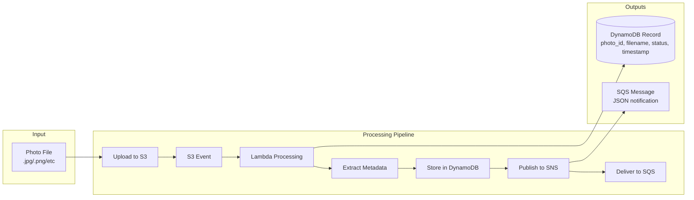

# Data Flow Pipeline

```mermaid
flowchart LR
    subgraph "Input"
        Photo[Photo File<br/>.jpg/.png/etc]
    end

    subgraph "Processing Pipeline"
        Upload[Upload to S3] --> Event[S3 Event]
        Event --> Process[Lambda Processing]
        Process --> Metadata[Extract Metadata]
        Metadata --> Store[Store in DynamoDB]
        Store --> Notify[Publish to SNS]
        Notify --> Queue[Deliver to SQS]
    end

    subgraph "Outputs"
        DB[(DynamoDB Record<br/>photo_id, filename, status, timestamp)]
        Message[SQS Message<br/>JSON notification]
    end

    Photo --> Upload
    Process --> DB
    Notify --> Message
```

Shows how data transforms and flows through each processing stage in the photo processing pipeline.