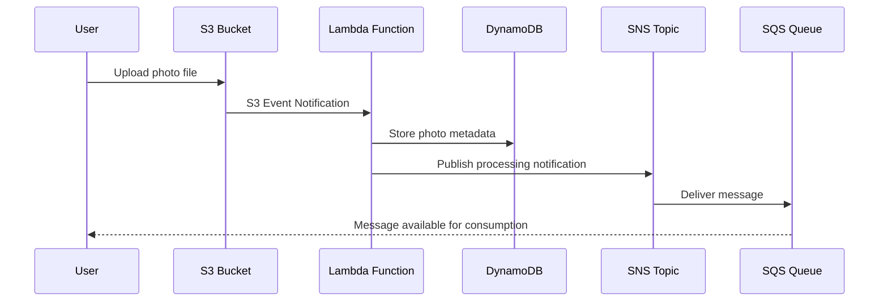

# Event Flow Sequence

```mermaid
sequenceDiagram
    participant U as User
    participant S3 as S3 Bucket
    participant L as Lambda Function
    participant D as DynamoDB
    participant SNS as SNS Topic
    participant SQS as SQS Queue

    U->>S3: Upload photo file
    S3->>L: S3 Event Notification
    L->>D: Store photo metadata
    L->>SNS: Publish processing notification
    SNS->>SQS: Deliver message
    SQS-->>U: Message available for consumption
```

Illustrates the step-by-step process from photo upload to message delivery in the photo processing pipeline.